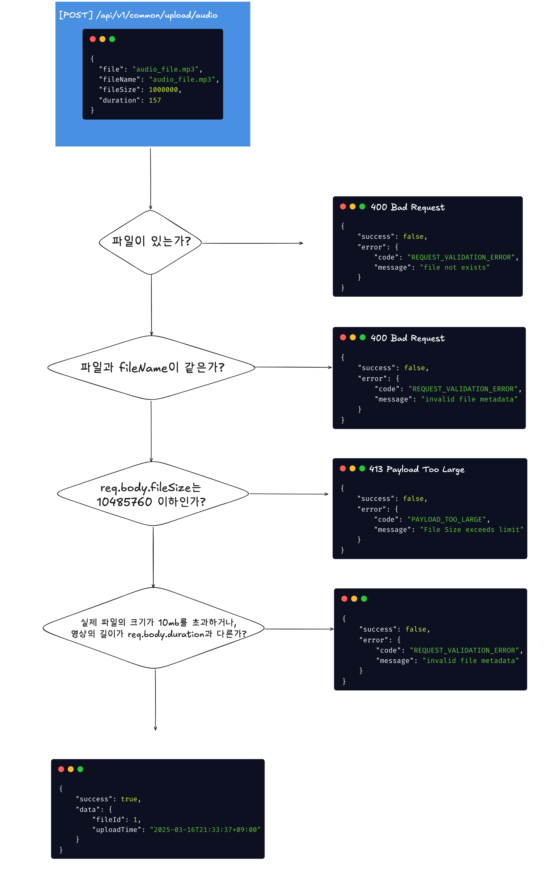
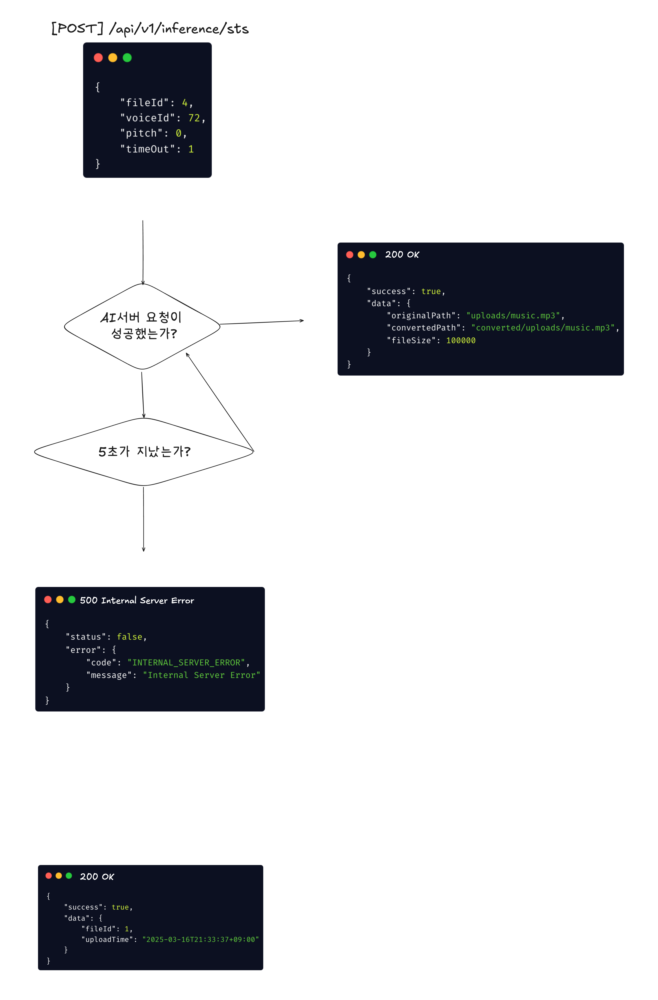
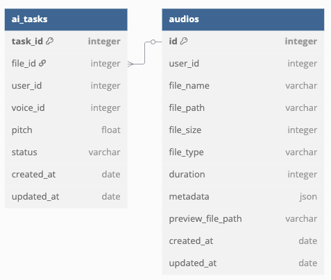

# Wavedeck Backend API

- Node.js 18.17 + Express.js 4.15.2
- MySQL 8.0 + Sequelize

## 웹서버 실행

1. 환경변수 설정: ./env/.production.env

```
  # 앱 설정
  PORT=3000
  NODE_ENV=production

  # 데이터베이스 설정
  DB_HOST=db
  DB_PORT=3306
  DB_USERNAME=root
  DB_PASSWORD=password
  DB_DATABASE=wavedeck
  DB_SYNC=true

  # MySQL 설정
  MYSQL_ROOT_PASSWORD=password
  MYSQL_DATABASE=wavedeck
```

2. 컨테이너 실행

```
NODE_ENV=production npm run release
```

3. db 마이그레이션 파일

```
src/api/config/database.ts
```

4. 아키텍처 구조

```
wavedeck
├── src
│   ├── api
│   │   └── routes
│   │       └── v1
│   │           └── common
│   │               └── upload
│   │                   └── audio
│   │       └── inference
│   │           └── sts
│   ├── controllers
│   ├── middlewares
│   └── schemas
```

5. [postman documentation](https://documenter.getpostman.com/view/17071448/2sAYkBt2Qf)

6. api 로직 순서도

1) 음성 파일 업로드



2. ai 변환 요청



7. DB_Guide

   
